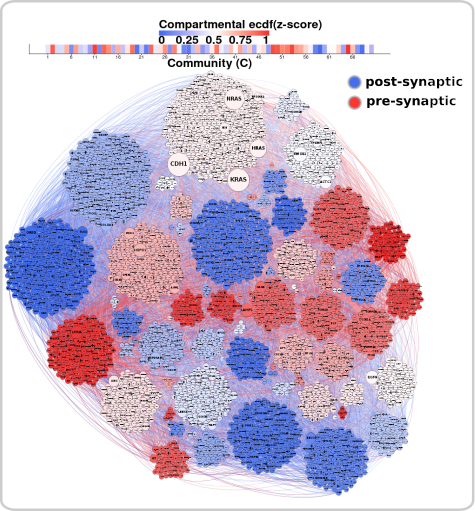

# rCDMSuite

R wrapper for Spectral Modularity method contained in CDMSuite.

  
  <!--  -->

To install in R, on the command line, using:
> R CMD INSTALL CDMSuite_0.1.0.tar.gz

Or in R using:
> install.packages("CDMSuite_0.1.0.tar.gz", repos=NULL, type="source")

To R in R:

> library(CDMSuite)

> res <- spectral(DF=edCC, CnMIN=CnMIN)

> oo  <- cbind(res$ID, res$K)

Where, edCC is the edge list of the input network's Largest Connected Component

Might run into "Error: segfault from C stack overflow" running in R.
1) Check C stack size in R> Cstack_info()
2) Can increase size on command line using $ ulimit -s 65535
3) Restart R and try again.
